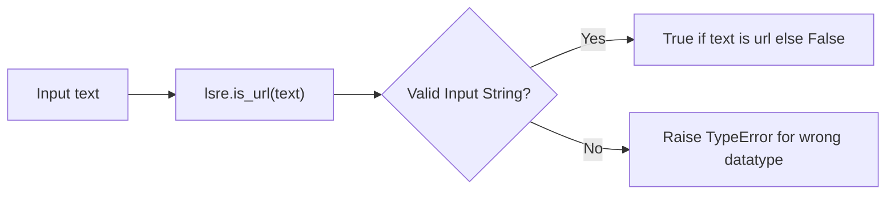

# Learn Simple Regular Expressions

[](https://github.com/rohit1998/lsre/actions/workflows/pr-checks.yml)
[](https://rohit1998.github.io/lsre/)
[](https://pypi.org/project/lsre/)
[](https://pypi.org/project/lsre/)

A project to learn simple regular expressions. Also publish package to
pypi to learn automated publishing.

This project contains list of regex based functions.

>Warning: This is just for learning purposes and should not be used
>in production use case.

## Quick Start

### Installation

#### Using UV (Recommended)

```bash
uv add lsre
```

OR

```bash
uv pip install lsre
```

#### Using pip

```bash
pip install lsre
```

### Usage

```python
>>> from lsre import is_iso_date
>>> is_iso_date('2025-08-22')
True
>>> is_iso_date('1999-13-01')
False
```

## Architecture

Each function in module follows this template.



## More details

For full list of available functions, see the
[Code Reference](reference/lsre) section of the docs.
