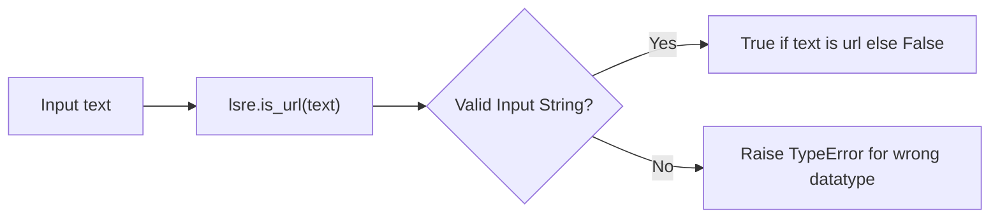

# Learn Simple Regular Expressions

A project to learn simple regular expressions.

This project contains list of regex based functions.

>Warning: This is just for learning purposes and should not be used
>in production use case.

## Quick Start

### Installation

```bash
git clone git@github.com:rohit1998/lsre.git
uv sync
```

### Usage

```python
>>> from lsre import is_iso_date
>>> is_iso_date('2025-08-22')
True
>>> is_iso_date('1999-13-01')
False
```

## Architecture

Each function in module follows this template.



## More details

For full list of available functions, see the
[Code Reference](reference/lsre) section of the docs.
